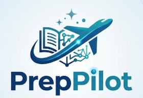

<p align="center">
  
</p>

<h1 align="center">🎓 PrepPilot AI</h1>

<p align="center">
<b>Intelligent Student Learning & Analytics Platform</b>
<br>
AI-powered academic assistance using Retrieval-Augmented Generation (RAG), Natural Language to SQL, Learning Analytics, Adaptive Test Generation, and Large Language Models.
</p>

<p align="center">


</p>

---

# 📖 Overview

PrepPilot AI is an AI-powered academic assistant that transforms traditional student portals into an intelligent learning platform.

Rather than simply displaying marks and attendance, PrepPilot leverages Large Language Models (LLMs), Retrieval-Augmented Generation (RAG), Natural Language to SQL, and learning analytics to deliver personalized academic support.

Students can interact with their academic data conversationally, generate customized assessments, receive AI-powered explanations, and gain actionable insights into their performance—all from a single intuitive dashboard.

The platform enables students to:

- 🔐 Securely log in using Student ID & Password
- 🏫 Chat with an AI-powered College Assistant using RAG
- 📝 Generate personalized MCQ practice tests
- 💬 Query academic records using Natural Language
- 📊 Explore interactive learning analytics dashboards
- 📈 Visualize subject-wise performance
- 🎯 Identify weak subjects automatically
- 🤖 Receive AI-generated explanations and recommendations
- 📚 View confidence scores and document sources for AI responses

---

# 🚀 Features

| Feature | Description |
|---------|-------------|
| 🔐 Student Authentication | Secure login system using Student ID & Password |
| 🏫 AI College Assistant | Retrieval-Augmented chatbot answering university-related questions |
| 📝 AI Test Generator | Generates customized MCQ tests based on subject and difficulty |
| 💬 Natural Language to SQL | Ask academic questions in plain English |
| 📊 Student Analytics Dashboard | Displays rankings, averages, weak subjects and insights |
| 📈 Interactive Charts | Plotly-based performance visualizations |
| 📚 Source Attribution | Shows retrieved documents used for AI responses |
| 🎯 Confidence Score | Displays retrieval confidence for every AI answer |
| 🤖 AI Explanations | Explains SQL query results in natural language |
| 🎨 Modern UI | Custom Streamlit interface with responsive dashboard |

---

# 📌 System Architecture

```text
                      Student Login
                            │
                            ▼
                  Authentication System
                            │
        ┌───────────────────┼───────────────────┐
        ▼                   ▼                   ▼
 Learning Analytics   AI College Assistant   AI SQL Assistant
        │                   │                   │
        ▼                   ▼                   ▼
 SQLite Database     Chroma Vector DB     SQLite Database
        │                   │                   │
        ▼                   ▼                   ▼
 Performance Data   Similarity Retrieval   SQL Generation
        │                   │                   │
        └───────────────┬───┴───────────────────┘
                        ▼
               Groq Large Language Model
                        │
        ┌───────────────┼───────────────────┐
        ▼               ▼                   ▼
 AI Responses     Test Generation     SQL Explanations
                        │
                        ▼
              Interactive Streamlit UI
